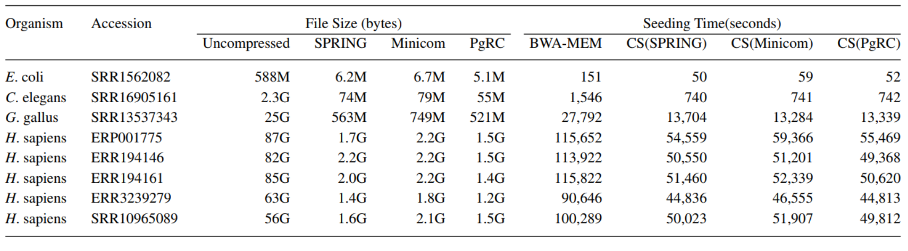
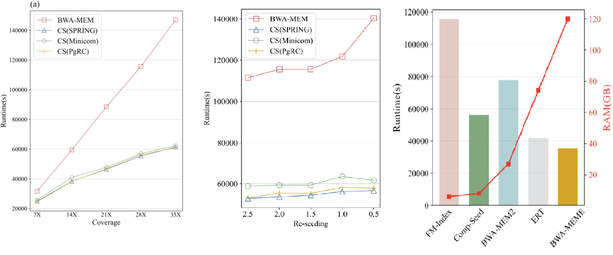

# CompSeed: a compressive seeding algorithm in conjunction with reordering-based compression

## Installation

Make sure the dependencies have been installed.
- cmake >= 3.10
- gcc >= 6.4
- zlib >= 1.2

Install CompSeed from source.
```
git clone https://github.com/i-xiaohu/CompSeed.git
cd CompSeed; mkdir build; cd build
cmake ..; make
```

If the installation is successful, the build subdirectory will contain the executable files.
 - `bwaidx` to create the FM-index for a reference file.
 - `bwamem_seeding` to run BWA-MEM seeding for sequencing reads.
 - `comp_seeding` to run compressive seeding for reordered reads.

## Declaration

CompSeed is an algorithm demonstration for compressive alignment, by far not a standalone tool. It 
received the reads compressed and reordered by upstream reordering-based compressors, including 
[SPRING](https://github.com/shubhamchandak94/Spring),  [Minicom](https://github.com/yuansliu/minicom) 
and [PgRC](https://github.com/kowallus/PgRC). While CompSeed can only support for single-end compression and alignment, 
the project of integrating compression and alignment is underway.

## Example usage

Build the FM-index for the reference sequence, for example `hg19.fna`.

```bash
bwaidx -p hg19 hg19.fna
``` 

Compress sequencing data with reordering-based compressors.
```bash
spring -c -t 16 --no-ids --no-quality -r -i data.fq -o data.spring
minicom -r data.fq -t 16; mv data_comp.minicom data.minicom
pgrc -t 16 -i data.fq data.pgrc
```

Decompress to obtain the reordered reads.
```bash
spring -d -t 16 -i data.spring -o spring.reads
minicom -d data.mincom -t 16; mv data_dec.reads minicom.reads
pgrc -t 16 -d data.pgrc; mv data.pgrc_out pgrc.reads
```

Run BWA-MEM seeding and record the time.
```bash
/usr/bin/time bwamem_seeding -t 16 hg19 data.fq 
```

Run CompSeed and record the time.
```bash
/usr/bin/time comp_seeding -t 16 hg19 spring.reads 
/usr/bin/time comp_seeding -t 16 hg19 minicom.reads
/usr/bin/time comp_seeding -t 16 hg19 pgrc.reads
```

Both `bwamem_seeding` and `comp_seeding` have an option `--print` to output seeds in text format to stdout for
checking the seed identity. But do not turn it on when comparing the speed because the output time significantly degrades
the benchmarked results.

For `bwamem_seeding` and `comp_seeding`, all the original parameters of BWA-MEM seeding are supported.
```
    -t  number of threads
    -k  minimum seed length
    -r  look for internal seeds inside a seed longer than {-k} * {-r}
    -y  seed occurrence for the 3rd round seeding
    -c  skip seeds with more than {-c} occurrences
    -K  process {-K} input bases in each batch regardless of nThreads (for reproducibility)
```

## Results
CompSeed fully utilizes the redundancy information provided from upstream compressors, and avoids ~50% of the redundant
time-consuming FM-index operations during the BWA-MEM seeding process.



It shows enhanced performance as sequencing coverage increases, and it is almost not affected by the re-seeding parameter.
Moreover, it has substantial memory advantage compared with the existing solutions, because it does not replace or modify 
the FM-index. All the acceleration benefits from the compression, thus does not conflict with existing hardware-based optimizations.


## References

* Chandak, S., *et al*. (2019) SPRING: a next-generation compressor for FASTQ data, *Bioinformatics*, **35**,
  2674-2676.
* Liu, Y., *et al*. (2019) Index suffix–prefix overlaps by (w, k)-minimizer to generate long contigs for reads compression, *Bioinformatics*, **35**,
  2066-2074.
* Kowalski, T.M. and Grabowski, S. (2020) PgRC: pseudogenome-based read compressor, *Bioinformatics*, **36**,
  2082-2089.
* Li H. (2013) Aligning sequence reads, clone sequences and assembly contigs
  with BWA-MEM.

